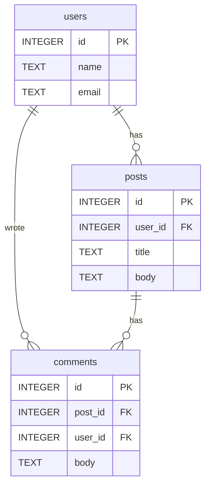

# mcp-sql Improvements — Feature + Distribution Design

**Date:** 2026-02-20
**Goal:** Differentiate mcp-sql from competitors and increase adoption through new tools, quality-of-life improvements, and distribution.

---

## New MCP Tools

### 1. `show_schema`

Returns a Mermaid ER diagram of all tables and their FK relationships in a connected database.

**Parameters:**
- `database?: String` — target database (optional if single DB)

**Output:** Mermaid markdown block that LLMs can render for users.

**Example:**


**Implementation:** Reuse `describe_table` internals (column types, PK/FK info) for all tables, then format as Mermaid. FK relationships drive the edge lines.

### 2. `show_create_table`

Returns the DDL (CREATE TABLE statement) for a given table.

**Parameters:**
- `table: String` — table name
- `database?: String` — target database

**Implementation:**
- PostgreSQL: `SELECT pg_get_tabledef(...)` or reconstruct from information_schema
- SQLite: `SELECT sql FROM sqlite_master WHERE name = ?`
- MySQL: `SHOW CREATE TABLE <table>`

### 3. `query_dry_run`

Parses and validates SQL without executing. Returns affected tables and estimated cost.

**Parameters:**
- `sql: String` — the query to validate
- `database?: String` — target database

**Output:** JSON with `{ valid: bool, tables: [...], warnings: [...], estimated_rows?: number }`

**Implementation:**
- PostgreSQL: `EXPLAIN (FORMAT JSON)` without executing
- SQLite: `EXPLAIN QUERY PLAN` (read-only, doesn't execute)
- MySQL: `EXPLAIN FORMAT=JSON`

---

## Improvements to Existing Tools

### `list_tables` — Fix SQLite row counts

Currently returns 0 for all SQLite tables. Fix: run `SELECT COUNT(*) FROM <table>` with a 1s timeout. Fall back to 0 if timeout or table is too large.

### `describe_table` — Add index information

Add index names, columns, and uniqueness constraints to the output.
- PostgreSQL: `pg_indexes`
- SQLite: `PRAGMA index_list()` + `PRAGMA index_info()`
- MySQL: `SHOW INDEX FROM <table>`

### `sample_data` — Add filter option

Add optional `where?: String` parameter to filter sampled rows. Sanitize to prevent injection (prepend `WHERE` if not present, reject if contains `;`).

---

## Distribution

### Pre-built binaries

Use `cargo-dist` or GitHub Actions matrix to produce release binaries:
- `mcp-sql-x86_64-unknown-linux-gnu`
- `mcp-sql-aarch64-apple-darwin`
- `mcp-sql-x86_64-apple-darwin`
- `mcp-sql-x86_64-pc-windows-msvc`

Trigger on git tag `v*`. Upload to GitHub Releases with install script.

### MCP directory listings

Submit to:
- [mcp.so](https://mcp.so)
- [glama.ai/mcp/servers](https://glama.ai/mcp/servers)
- [pulsemcp.com](https://www.pulsemcp.com)
- [awesome-mcp-servers](https://github.com/punkpeye/awesome-mcp-servers) (PR)

### `--demo` flag

`mcp-sql --demo` starts with an in-memory SQLite database pre-loaded with sample tables:
- `users` (id, name, email, created_at) — 10 rows
- `posts` (id, user_id, title, body, created_at) — 25 rows
- `comments` (id, post_id, user_id, body, created_at) — 50 rows

FK relationships between them. Lets people try all 6+ tools immediately without providing a database URL.

### README onboarding

Add Claude Code one-liner:
```bash
claude mcp add mcp-sql -- mcp-sql --url sqlite:mydb.db
```

---

## Implementation Order

1. `--demo` flag (instant try-it-out experience)
2. `show_schema` tool (biggest differentiator)
3. `show_create_table` tool (low effort, high value)
4. `list_tables` row count fix + `describe_table` index info
5. `query_dry_run` tool
6. `sample_data` filter option
7. Pre-built binaries (GitHub Actions)
8. MCP directory submissions
9. Version bump to 0.2.0, publish

## Dependencies

No new dependencies needed. All features use existing sqlx queries.
